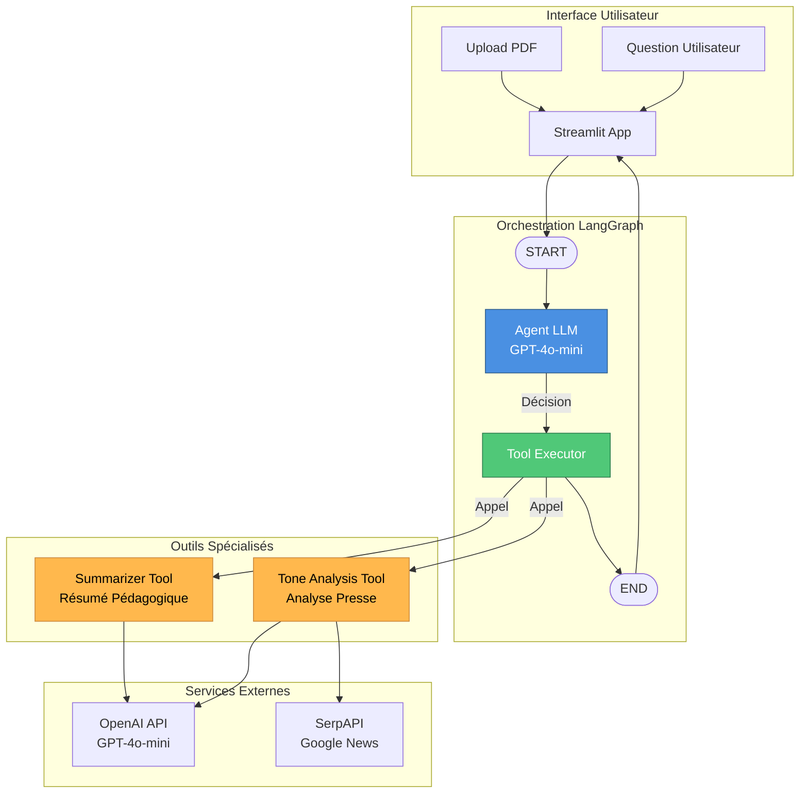
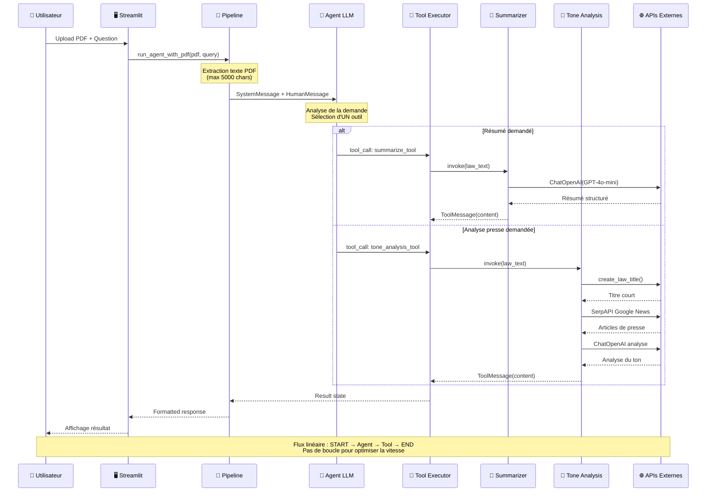

# 🏛️ Assistant Juridique - Analyse de Lois avec LangGraph

Un système d'agent IA autonome pour analyser des documents législatifs français. L'agent utilise LangGraph pour décider automatiquement quels outils utiliser : résumé pédagogique ou analyse du ton médiatique.

## 📋 Fonctionnalités

- **Upload de PDF** : Chargez des lois, propositions de loi ou rapports législatifs
- **Agent autonome** : L'IA décide automatiquement de l'outil approprié
- **Résumé pédagogique** : Simplification et explication des textes de loi
- **Analyse de presse** : Recherche et analyse du ton médiatique via Google News
- **Interface Streamlit** : Interface web intuitive et interactive
- **Visualisation LangGraph** : Affichage du graphe de décision de l'agent

## 🏗️ Architecture

### Diagramme d'Architecture



### Diagramme de Séquencement



## 🚀 Installation

### Prérequis

- Python 3.10+
- Clés API :
  - OpenAI API Key
  - SerpAPI Key (pour l'analyse de presse)

### Étapes

1. **Cloner le repository**

```bash
git clone https://github.com/Lavialle/agentic-systems-final-project.git
cd agentic-systems-final-project
```

2. **Créer un environnement virtuel**

```bash
python -m venv venv
venv\Scripts\activate  # Windows
# ou
source venv/bin/activate  # Linux/Mac
```

3. **Installer les dépendances**

```bash
pip install -r requirements.txt
```

4. **Configurer les clés API**
   Créez un fichier `config.py` à la racine :

```python
OPENAI_API_KEY = "sk-..."
SERPAPI_API_KEY = "votre-clé-serpapi"
LANGFUSE_PUBLIC_KEY = ""  # Optionnel
LANGFUSE_SECRET_KEY = ""  # Optionnel
LANGFUSE_BASE_URL = ""    # Optionnel
```

5. **Lancer l'application**

```bash
streamlit run app.py
```

## 📂 Structure du Projet

```
agentic-systems-final-project/
├── app.py                      # Interface Streamlit
├── pipeline.py                 # Orchestration LangGraph
├── summarizer_agent.py         # Agent de résumé
├── tone_analysis_agent.py      # Agent d'analyse de presse
├── config.py                   # Configuration des clés API
├── requirements.txt            # Dépendances Python
├── README.md                   # Documentation
└── data/                       # Dossier pour les données
```

## 🔧 Composants Techniques

### Agent LangGraph

- **StateGraph** : Gestion d'état avec `AgentState` (TypedDict)
- **Nodes** :
  - `agent` : Appel du LLM avec tools binding
  - `tool` : Exécution des outils sélectionnés
- **Edges** : START → agent → tool → END (flux linéaire)

### Outils (@tool decorator)

1. **summarize_tool** : Résumé pédagogique avec structure claire
2. **tone_analysis_tool** : Recherche Google News + analyse LLM

### Modèle LLM

- **GPT-4o-mini** (OpenAI)
- Temperature : 0.1 (déterministe)
- Limite : 5000 caractères (performance optimale)

## 💡 Utilisation

1. **Uploader un PDF** dans la barre latérale
2. **Poser une question** :
   - "Résume cette loi"
   - "Que dit la presse sur cette loi ?"
   - "Analyse le ton médiatique"
3. **L'agent décide automatiquement** quel outil utiliser
4. **Consulter le résultat** formaté en Markdown

## ⚡ Optimisations

- **Un seul outil par exécution** : Évite les appels multiples et les timeouts
- **Limite de texte (5000 chars)** : Réduit la latence et les coûts
- **Flux linéaire** : Pas de boucle agent après l'outil (tool → END direct)
- **System prompt optimisé** : Force la sélection d'UN seul outil

## 🎯 Choix de Design

### Pourquoi pas de Supervisor ?

L'architecture actuelle utilise un agent simple sans supervisor pour plusieurs raisons :

- **Performance** : 2 appels LLM au lieu de 3-4 avec supervisor
- **Simplicité** : Flux linéaire plus facile à déboguer
- **Contrainte métier** : Un seul outil suffit par requête
- **Rapidité** : Résultats en <10 secondes

Un supervisor serait utile pour :

- Exécuter plusieurs outils en séquence
- Synthétiser les résultats de multiples outils
- Boucles de décision complexes

## 📊 Technologies Utilisées

- **LangChain** : Framework d'orchestration LLM
- **LangGraph** : Graphes de workflows avec état
- **OpenAI** : Modèle GPT-4o-mini
- **SerpAPI** : Recherche Google News
- **Streamlit** : Interface web
- **PyPDF2** : Extraction de texte PDF

## 📝 License

MIT License

## 👥 Auteurs

Développé dans le cadre du cours d'Agentic Systems.
