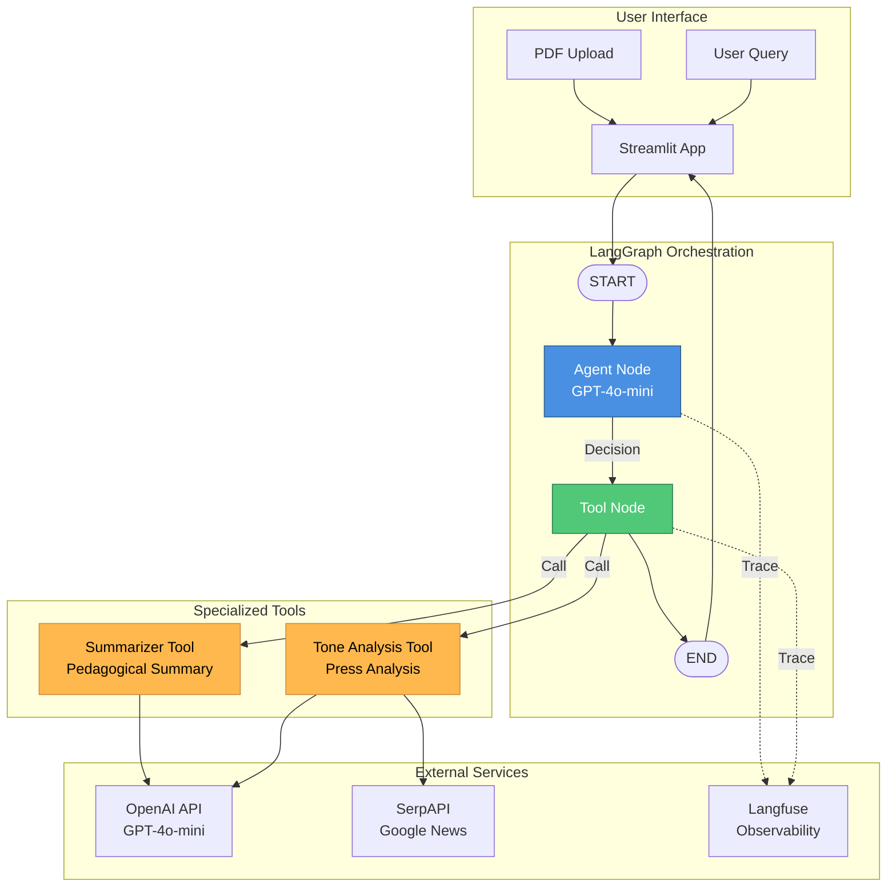
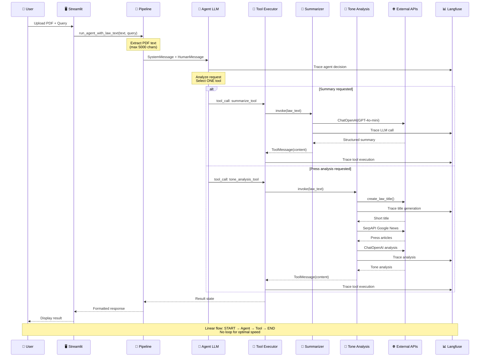

# 🏛️ Legal Assistant - French Law Analysis with LangGraph

An autonomous AI agent system for analyzing French legislative documents. The agent uses LangGraph to automatically decide which tools to use: pedagogical summary or media tone analysis.

## 📋 Features

- **PDF Upload**: Load laws, bill proposals, or legislative reports
- **Autonomous Agent**: AI automatically selects the appropriate tool
- **Pedagogical Summary**: Simplification and explanation of legal texts
- **Press Analysis**: Google News search and media tone analysis
- **Streamlit Interface**: Intuitive and interactive web interface
- **Langfuse Observability**: Complete tracing of LLM calls and agent execution

## 🏗️ Architecture

### Architecture Diagram



### Sequence Diagram



## 🚀 Installation

### Prerequisites

- Python 3.11+
- Docker (optional)
- API Keys:
  - OpenAI API Key
  - SerpAPI Key (for press analysis)
  - Langfuse Keys (optional, for observability)

### Local Setup

1. **Clone the repository**

```bash
git clone https://github.com/Lavialle/agentic-systems-final-project.git
cd agentic-systems-final-project
```

2. **Create virtual environment**

```bash
python -m venv venv
venv\Scripts\activate  # Windows
source venv/bin/activate  # Linux/Mac
```

3. **Install dependencies**

```bash
pip install -r requirements.txt
```

4. **Configure API keys**
   Create a `.env` file at the root:

```env
OPENAI_API_KEY=sk-...
SERP_API_KEY=your-serpapi-key
LANGFUSE_PUBLIC_KEY=pk-...
LANGFUSE_SECRET_KEY=sk-...
LANGFUSE_BASE_URL=https://cloud.langfuse.com
```

5. **Run the application**

```bash
streamlit run app.py
```

### Docker Setup

1. **Build and run with Docker Compose**

```bash
docker-compose up --build
```

2. **Access the application**
   Open your browser at [`http://localhost:8501`](http://127.0.0.1:8501)

3. **Stop the containers**

```bash
docker-compose down
```

## 📂 Project Structure

```
agentic-systems-final-project/
├── app.py                      # Streamlit interface
├── pipeline.py                 # LangGraph orchestration
├── summarizer_agent.py         # Summary agent
├── tone_analysis_agent.py      # Press analysis agent
├── config.py                   # API keys configuration
├── requirements.txt            # Python dependencies
├── Dockerfile                  # Docker image configuration
├── docker-compose.yml          # Docker Compose setup
├── .dockerignore               # Docker ignore rules
├── README.md                   # Documentation
└── data/                       # Data folder
```

## 🔧 Technical Components

### LangGraph Agent

- **StateGraph**: State management with `AgentState` (TypedDict)
- **Nodes**:
  - `agent`: LLM call with tools binding
  - `tool`: Selected tools execution
- **Edges**: START → agent → tool → END (linear flow)

### Tools (@tool decorator)

1. **summarize_tool**: Pedagogical summary with clear structure
2. **tone_analysis_tool**: Google News search + LLM analysis

### LLM Model

- **GPT-4o-mini** (OpenAI)
- Temperature: 0.1 (deterministic)
- Text limit: 5000 characters

### Observability

- **Langfuse**: Complete tracing with `@observe` decorators
- **Callbacks**: LLM calls tracking
- **Dashboard**: Real-time monitoring of agent execution

## 💡 Usage

1. **Upload a PDF** in the sidebar
2. **Ask a question**:
   - "Summarize this law"
   - "What does the press say about this law?"
   - "Analyze the media tone"
3. **The agent automatically decides** which tool to use
4. **View the result** formatted in Markdown

## 📊 Technologies Used

- **LangChain**: LLM orchestration framework
- **LangGraph**: State-based workflow graphs
- **OpenAI**: GPT-4o-mini model
- **SerpAPI**: Google News search
- **Streamlit**: Web interface
- **PyPDF2**: PDF text extraction
- **Langfuse**: LLM observability and tracing
- **Docker**: Containerization
